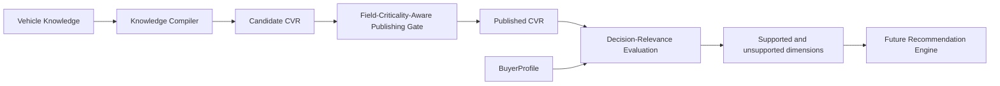

# Vehicle Field Criticality and Decision Relevance

Status: Phase 3.2E foundation policy. The decision-relevance evaluator is not connected to production recommendations.

## Two Separate Decisions

Publication asks whether trusted identity and stable vehicle knowledge are sufficient for a CanonicalVehicleRecord (CVR) to exist. Buyer-specific readiness asks whether the published CVR contains current, trusted evidence for the dimensions that matter to one BuyerProfile.



Publication quality is not recommendation confidence. A sparse but trustworthy CVR may publish, while a buyer-specific decision can remain under-supported. Conversely, an overall incomplete CVR can have high decision coverage when its trusted fields cover the buyer's narrow priorities.

## Policy Contract

`canonicalVehicleFieldPolicy` is a compile-time-complete `Record<CanonicalVehicleFieldPath, CanonicalVehicleFieldPolicy>`. It reuses the authoritative paths from `types/canonicalVehicle.ts`; the policy cannot omit or add a field without failing type or invariant tests.

Each field declares:

- ontology concept;
- publication criticality;
- qualification, scoring, explanation, or confidence roles;
- existing scoring categories, if any;
- freshness class;
- missing and stale behavior;
- supported buyer-decision dimensions.

## Publication Criticality

- `REQUIRED_IDENTITY`: `identity.make`, `identity.model`, and `identity.modelYear`. Missing, invalid, stale, or conflicted values block publication.
- `CORE_VEHICLE`: stable configuration facts that materially improve specificity but are not required to identify a model-year record. Missing facts remain explicit and can make a later buyer decision unsupported.
- `DECISION_RELEVANT`: facts that may qualify, score, or explain a vehicle when the buyer cares about the corresponding dimension. Absence does not invalidate unrelated vehicle intelligence.
- `OPTIONAL_ENRICHMENT`: useful comparison, perception, composite, or confidence context. Absence does not block publication.

Body style and vehicle category are `CORE_VEHICLE`, not required identity. They are publication-nonblocking because make, model, and model year establish the CVR identity. A missing body style still prevents the CVR from satisfying a buyer's required body-style decision.

## Freshness

Freshness is orthogonal to publication criticality:

- `STATIC`: factory or configuration facts that normally do not change.
- `SLOW_CHANGING`: population aggregates, perception, and long-term cost/risk knowledge that may evolve.
- `DYNAMIC`: ownership estimates and derived confidence that should be refreshed periodically.
- `HIGHLY_DYNAMIC`: listing-level price, payment, mileage, and condition.

This policy classifies behavior; it does not invent expiration windows. Actual freshness evaluation remains in the existing Vehicle Knowledge Trust Policy. A stale field is absent from the compiled current CVR and retains `missingReason: "stale"` plus diagnostics.

## Exact 73-Field Audit

“Scoring category” means an existing category the field could support. It does not activate new scoring.

| Canonical field | Ontology concept | Publication criticality | Freshness | Decision dimensions | Existing scoring categories |
| --- | --- | --- | --- | --- | --- |
| `identity.make` | `make` | REQUIRED_IDENTITY | STATIC | make | None |
| `identity.model` | `model` | REQUIRED_IDENTITY | STATIC | model | None |
| `identity.generation` | `generation` | CORE_VEHICLE | STATIC | None | None |
| `identity.trim` | `trim` | CORE_VEHICLE | STATIC | None | None |
| `identity.modelYear` | `model_year` | REQUIRED_IDENTITY | STATIC | modelYear | None |
| `identity.bodyStyle` | `body_style` | CORE_VEHICLE | STATIC | bodyStyle, practicality | practicality |
| `identity.vehicleCategory` | `vehicle_category` | CORE_VEHICLE | STATIC | vehicleCategory, practicality | practicality |
| `identity.drivetrain` | `drivetrain` | CORE_VEHICLE | STATIC | drivetrain, practicality, performance | practicality, drivingPreferenceFit |
| `identity.transmission` | `transmission` | CORE_VEHICLE | STATIC | transmission, performance | drivingPreferenceFit |
| `identity.fuelType` | `fuel_type` | CORE_VEHICLE | STATIC | fuelType, fuelEnergyCost, fuelEconomy, evRange | fuelEnergyCost |
| `identity.odometerMileage` | `odometer_mileage` | DECISION_RELEVANT | HIGHLY_DYNAMIC | mileage, affordability, reliability, resaleValue | affordability, reliability, resaleValue |
| `identity.condition` | `condition` | DECISION_RELEVANT | HIGHLY_DYNAMIC | condition, affordability, maintenanceRisk, resaleValue | affordability, maintenanceRisk, resaleValue |
| `financial.purchasePrice` | `purchase_price` | DECISION_RELEVANT | HIGHLY_DYNAMIC | purchaseBudget, affordability | affordability |
| `financial.monthlyPayment` | `monthly_payment` | DECISION_RELEVANT | HIGHLY_DYNAMIC | monthlyPayment, affordability | affordability |
| `financial.totalOwnershipCost` | `ownership_cost` | DECISION_RELEVANT | DYNAMIC | totalOwnershipBudget, affordability | affordability |
| `financial.maintenanceCost` | `maintenance_cost` | DECISION_RELEVANT | SLOW_CHANGING | maintenanceRisk | maintenanceRisk |
| `financial.insuranceCost` | `insurance_cost` | DECISION_RELEVANT | DYNAMIC | insuranceCost | insuranceCost |
| `financial.depreciation` | `depreciation` | DECISION_RELEVANT | DYNAMIC | resaleValue, affordability | resaleValue, affordability |
| `financial.resaleValue` | `resale_value` | DECISION_RELEVANT | SLOW_CHANGING | resaleValue | resaleValue |
| `financial.fuelEnergyCost` | `fuel_cost` | DECISION_RELEVANT | DYNAMIC | fuelEnergyCost | fuelEnergyCost |
| `safety.crashSafety` | `crash_safety` | DECISION_RELEVANT | SLOW_CHANGING | safety | safety |
| `safety.activeSafety` | `active_safety` | DECISION_RELEVANT | SLOW_CHANGING | safety | safety |
| `safety.passiveSafety` | `passive_safety` | DECISION_RELEVANT | SLOW_CHANGING | safety | safety |
| `safety.driverAssistanceSafety` | `driver_assistance` | DECISION_RELEVANT | SLOW_CHANGING | safety, technology | safety |
| `reliability.longTermReliability` | `long_term_reliability` | DECISION_RELEVANT | SLOW_CHANGING | reliability | reliability |
| `reliability.repairFrequency` | `repair_frequency` | DECISION_RELEVANT | SLOW_CHANGING | reliability, maintenanceRisk | reliability, maintenanceRisk |
| `reliability.repairSeverity` | `repair_severity` | DECISION_RELEVANT | SLOW_CHANGING | reliability, maintenanceRisk | reliability, maintenanceRisk |
| `reliability.knownIssues` | `known_issues` | DECISION_RELEVANT | SLOW_CHANGING | reliability, maintenanceRisk | reliability, maintenanceRisk |
| `driving.acceleration` | `acceleration` | DECISION_RELEVANT | STATIC | performance | drivingPreferenceFit |
| `driving.handling` | `handling` | DECISION_RELEVANT | STATIC | performance | drivingPreferenceFit |
| `driving.steering` | `steering` | DECISION_RELEVANT | STATIC | performance | drivingPreferenceFit |
| `driving.rideControl` | `ride` | DECISION_RELEVANT | STATIC | performance, comfort | drivingPreferenceFit |
| `driving.braking` | `braking` | DECISION_RELEVANT | STATIC | performance, safety | drivingPreferenceFit, safety |
| `driving.offRoadCapability` | `off_road` | DECISION_RELEVANT | STATIC | performance, practicality, lifestyle | practicality, drivingPreferenceFit |
| `driving.towingCapacity` | `towing` | DECISION_RELEVANT | STATIC | practicality, lifestyle | practicality |
| `comfort.seatComfort` | `seat_comfort` | DECISION_RELEVANT | STATIC | comfort | None |
| `comfort.suspensionComfort` | `suspension_comfort` | DECISION_RELEVANT | STATIC | comfort | None |
| `comfort.cabinNoise` | `cabin_noise` | DECISION_RELEVANT | STATIC | comfort | None |
| `comfort.rideSmoothness` | `ride_smoothness` | DECISION_RELEVANT | STATIC | comfort | None |
| `comfort.climateComfort` | `climate_comfort` | DECISION_RELEVANT | STATIC | comfort | None |
| `technology.infotainment` | `infotainment` | OPTIONAL_ENRICHMENT | STATIC | technology | None |
| `technology.smartphoneIntegration` | `smartphone_integration` | OPTIONAL_ENRICHMENT | STATIC | technology | None |
| `technology.navigation` | `navigation` | OPTIONAL_ENRICHMENT | STATIC | technology | None |
| `technology.driverAssistanceTechnology` | `driver_assistance` | DECISION_RELEVANT | STATIC | technology, safety | safety |
| `technology.softwareExperience` | `software` | OPTIONAL_ENRICHMENT | SLOW_CHANGING | technology | None |
| `technology.chargingTechnology` | `charging` | DECISION_RELEVANT | STATIC | technology, charging | None |
| `practicality.cargoCapacity` | `cargo` | DECISION_RELEVANT | STATIC | practicality, lifestyle | practicality |
| `practicality.passengerRoom` | `passenger_room` | DECISION_RELEVANT | STATIC | seating, practicality, lifestyle | practicality |
| `practicality.parkingEase` | `parking_ease` | DECISION_RELEVANT | STATIC | practicality, lifestyle | practicality |
| `practicality.outwardVisibility` | `visibility` | DECISION_RELEVANT | STATIC | practicality, safety | practicality, safety |
| `practicality.storageUtility` | `storage` | DECISION_RELEVANT | STATIC | practicality, lifestyle | practicality |
| `practicality.interiorFlexibility` | `flexibility` | DECISION_RELEVANT | STATIC | practicality, lifestyle | practicality |
| `environment.fuelEconomy` | `fuel_economy` | DECISION_RELEVANT | STATIC | fuelEconomy, fuelEnergyCost | fuelEnergyCost |
| `environment.emissions` | `emissions` | OPTIONAL_ENRICHMENT | STATIC | emissions | None |
| `environment.evRange` | `ev_range` | DECISION_RELEVANT | STATIC | evRange | None |
| `environment.chargingSpeed` | `charging_speed` | DECISION_RELEVANT | STATIC | charging | None |
| `image.luxuryPerception` | `luxury_perception` | OPTIONAL_ENRICHMENT | SLOW_CHANGING | image | None |
| `image.sportyImage` | `sporty_image` | OPTIONAL_ENRICHMENT | SLOW_CHANGING | image | None |
| `image.ruggedImage` | `rugged_image` | OPTIONAL_ENRICHMENT | SLOW_CHANGING | image | None |
| `image.premiumImage` | `premium_image` | OPTIONAL_ENRICHMENT | SLOW_CHANGING | image | None |
| `image.understatedImage` | `understated_image` | OPTIONAL_ENRICHMENT | SLOW_CHANGING | image | None |
| `lifestyle.collegeStudentFit` | `college_student_fit` | OPTIONAL_ENRICHMENT | SLOW_CHANGING | lifestyle | None |
| `lifestyle.familyFit` | `family_fit` | OPTIONAL_ENRICHMENT | SLOW_CHANGING | lifestyle | None |
| `lifestyle.campingFit` | `camping_fit` | OPTIONAL_ENRICHMENT | SLOW_CHANGING | lifestyle | None |
| `lifestyle.petFit` | `pet_fit` | OPTIONAL_ENRICHMENT | SLOW_CHANGING | lifestyle | None |
| `lifestyle.commutingFit` | `commuting_fit` | OPTIONAL_ENRICHMENT | SLOW_CHANGING | lifestyle | None |
| `lifestyle.snowFit` | `snow_fit` | OPTIONAL_ENRICHMENT | SLOW_CHANGING | lifestyle | None |
| `lifestyle.roadTripFit` | `road_trip_fit` | OPTIONAL_ENRICHMENT | SLOW_CHANGING | lifestyle | None |
| `lifestyle.cityFit` | `city_fit` | OPTIONAL_ENRICHMENT | SLOW_CHANGING | lifestyle | None |
| `lifestyle.businessFit` | `business_fit` | OPTIONAL_ENRICHMENT | SLOW_CHANGING | lifestyle | None |
| `confidence.dataQuality` | `data_quality` | OPTIONAL_ENRICHMENT | DYNAMIC | None | None |
| `confidence.evidenceQuality` | `evidence_quality` | OPTIONAL_ENRICHMENT | DYNAMIC | None | None |
| `confidence.sourceAgreement` | `source_agreement` | OPTIONAL_ENRICHMENT | DYNAMIC | None | None |

## Publishing Rules

The gate uses `maximumBlockingStaleFields: 0`, replacing the coarse global stale count. It still reports total, blocking, and non-blocking stale counts and paths.

- Missing or stale required identity produces `HOLD`.
- Broken schema, evidence references, or trusted-claim lineage produces `REJECT`.
- Unresolved source conflicts remain blocking and produce `HOLD`.
- Missing core, decision-relevant, or optional fields remain explicit but do not alone block publication.
- Stale non-identity fields remain `missing` with a stale diagnostic and cannot be used for a current buyer decision.
- An unmapped stale summary is conservatively counted as blocking.

The gate does not recalculate trust, repair conflicts, persist records, or change the original catalog.

## Decision Relevance API

```ts
evaluateVehicleDecisionReadiness(
  buyerProfile: BuyerProfile,
  cvr: CanonicalVehicleRecord,
): VehicleDecisionReadiness
```

The result separates relevant, supported, unsupported, stale, and conflicted dimensions. It also returns field-level availability, scoring eligibility, decision coverage, confidence impact, and structured disclosures.

### Participation invariant

A dimension can participate only when:

1. the BuyerProfile or decision policy makes it relevant; and
2. the CVR contains sufficiently trusted, current evidence for its required field group.

The evaluator does not produce a category score. An unavailable dimension is placed in `scoringIneligibleDimensions`; no neutral, average, zero, or perfect score is supplied.

### No-data states

- `TRUSTED`: current sourced, verified, or derived evidence with lineage and confidence; eligible.
- `ESTIMATED`: eligible only when evidence exists and confidence is at least medium/55; adds a confidence caution.
- `MISSING`: unavailable.
- `STALE`: unavailable for current scoring.
- `CONFLICTED`: unavailable until resolved.
- `UNTRUSTED`: unavailable because evidence or confidence is insufficient.

## Decision Coverage

Each relevant dimension receives a deterministic relevance weight:

- enforced requirement: `4`;
- active preference: `1 + 2 × importance`, defaulting to `2`;
- deprioritized preference: `0.5`;
- unresolved preference: `1`.

For a dimension, `supportRatio = eligible fields / expected fields`. Overall decision coverage is:

```text
100 × sum(dimension weight × support ratio) / sum(relevant dimension weights)
```

Coverage is rounded to a whole percentage. A dimension is scoring-eligible only when its minimum support count is met. Coverage can still disclose partial evidence separately.

## Confidence Separation

- CVR data quality: broad record coverage and structural quality.
- Evidence quality: authority and completeness of evidence used by populated fields.
- Source agreement: compatibility among independent sources.
- Decision coverage: support for this buyer's relevant dimensions.
- Recommendation confidence: a later recommendation-level judgment that may consume the preceding measures but must not equal any one of them.

The evaluator returns only a confidence impact: coverage penalty plus a small, separately reported estimated-data caution. It does not overwrite CVR confidence or calculate final recommendation confidence.

## Disclosure Policy

- Irrelevant missing knowledge: no disclosure and no coverage penalty.
- Supporting missing knowledge: `CONFIDENCE_ONLY`; suitable for optional uncertainty detail.
- Required or important missing knowledge: `REQUIRED`; the advisor must disclose the decision gap.
- Stale or conflicted evidence follows the same relevance rule but is never factual support.
- UI wording remains the responsibility of the future communication-layer integration.

## Golden-Set Implications

Under this policy, stale `financial.fuelEnergyCost` remains missing and diagnosed but does not block publication. It will reduce decision coverage only for buyers whose fuel or ownership-cost decision depends on it. Missing body style does not block a model-year CVR, but a buyer requiring a body style cannot use that CVR for that requirement until trusted body-style evidence is present.

## Future Integration

Production recommendations remain on the existing immutable catalog and current recommendation engine. A later reviewed task may provide CVR capability flags to scoring, remove unavailable category weights, normalize the remaining weights, and feed structured disclosures to the advisor. That integration must include ranking-equivalence and ranking-change tests and must never let the semantic model select vehicles.
