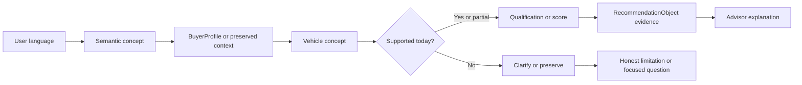

# Vehicle Intelligence Ontology

Status: Phase 3.2A authoritative domain reference

Version: 1.0

Date: July 28, 2026

## Purpose

This document defines the vehicle concepts the advisor may use for recommendation, qualification, clarification, explanation, confidence, or future data acquisition. It is a domain model, not a dataset and not a scoring specification.

The ontology has 73 canonical concepts in 12 categories. A concept appearing here does not mean the current catalog contains the data or that the current recommendation engine may score it.

This document is authoritative for future vehicle datasets:

- A future field must map to one canonical concept before entering the normalized vehicle record.
- A semantic interpretation must not affect a recommendation unless it maps through `BuyerProfile` to a supported vehicle concept.
- A concept must not become scoreable merely because a source supplies a value.
- Missing evidence must remain missing. It must not be converted into a neutral, average, or favorable value.
- Recommendation confidence and data quality remain separate from match score.
- Existing scoring formulas remain unchanged until a later approved phase explicitly adds a concept.

## Support Terms

| Term | Meaning |
| --- | --- |
| Supported today: Yes | The current catalog and decision pipeline represent the concept directly enough to use it. |
| Supported today: Partial | The current system uses a coarse aggregate, proxy, derived value, or incomplete representation. |
| Supported today: No | The advisor may understand the idea, but no current vehicle-level decision field supports it. |
| Scoreable | The concept can affect today's numerical ranking. `Partial` means only through an aggregate or proxy. |
| Filterable | The concept can currently qualify or exclude a vehicle when the user makes it mandatory. |
| Explainable | The advisor has enough structured vehicle evidence to mention the concept as a reason, tradeoff, or fact. |

Confidence-source abbreviations used below:

- **Direct:** field provenance, source identity, and data date can be attached to the value.
- **Derived:** confidence comes from the completeness and quality of every formula input.
- **Aggregate:** confidence applies to a combined score, not to each underlying sub-concept.
- **Proxy:** confidence is limited because another field stands in for the concept.
- **None:** no current vehicle evidence exists; the advisor may preserve the user's intent but must not claim a vehicle fit.

Possible future source families:

- **OEM:** manufacturer specifications, build sheets, owner's manuals, and equipment lists.
- **NHTSA:** vPIC identity data, recall data, complaints, and New Car Assessment Program data.
- **EPA:** FuelEconomy.gov fuel, emissions, efficiency, range, and charging data.
- **IIHS:** crashworthiness, crash avoidance, lighting, and safety equipment evaluations.
- **Listings:** licensed listing feeds, dealer inventory, auctions, and transaction histories.
- **Ownership:** licensed insurance, repair, warranty, maintenance, and depreciation datasets.
- **Reviews:** consistently structured professional testing and instrumented review data.
- **Surveys:** methodologically documented owner experience and reliability surveys.
- **Charging:** charging-network and vehicle charging-session data.
- **Derived:** deterministic calculations from normalized, provenance-bearing source fields.

## Ontology Tree

```text
Vehicle Intelligence
├── Identity (12)
│   ├── make, model, generation, trim, model year
│   ├── body style, vehicle category
│   ├── drivetrain, transmission, fuel type
│   └── odometer mileage, condition
├── Financial (8)
│   ├── purchase price, monthly payment, total ownership cost
│   ├── maintenance cost, insurance cost, fuel or energy cost
│   └── depreciation, resale value
├── Safety (4)
│   ├── crash safety, active safety, passive safety
│   └── driver assistance safety
├── Reliability (4)
│   ├── long-term reliability, repair frequency
│   ├── repair severity, known issues
├── Driving (7)
│   ├── acceleration, handling, steering, ride control, braking
│   └── off-road capability, towing capacity
├── Comfort (5)
│   ├── seat comfort, suspension comfort, cabin noise
│   └── ride smoothness, climate comfort
├── Technology (6)
│   ├── infotainment, smartphone integration, navigation
│   ├── driver-assistance technology, software experience
│   └── charging technology
├── Practicality (6)
│   ├── cargo capacity, passenger room, parking ease
│   └── outward visibility, storage utility, interior flexibility
├── Environment (4)
│   ├── fuel economy, emissions, EV range, charging speed
├── Image (5)
│   ├── luxury perception, sporty image, rugged image
│   └── premium image, understated image
├── Lifestyle (9)
│   ├── college-student fit, family fit, camping fit, pet fit
│   ├── commuting fit, snow fit, road-trip fit, city fit
│   └── business fit
└── Confidence (3)
    ├── data quality, evidence quality, source agreement
```

## 1. Identity

| Canonical concept | Description | Today | Scoreable | Filterable | Explainable | Confidence source | Possible future sources | BuyerProfile relationship | Explanation relationship |
| --- | --- | --- | --- | --- | --- | --- | --- | --- | --- |
| `make` | Canonical manufacturer identity. | Yes | Partial | Yes | Yes | Direct | OEM, NHTSA, Listings | Required, preferred, allowed, and excluded make arrays. | Requirement result, preference fit, or relaxed-brand tradeoff. |
| `model` | Canonical nameplate within a make. | Partial | No | No | Yes | Direct | OEM, NHTSA, Listings | No model filter today; model references remain preserved context. | Vehicle identity only; must not imply a model preference was honored. |
| `generation` | Engineering generation or platform interval for a model. | No | No | No | No | None | OEM, NHTSA, Reviews | No current field; future generation requirement or preference. | Future generation-specific reliability, safety, and equipment context. |
| `trim` | Equipment or performance variant within a model year. | No | No | No | No | None | OEM build data, Listings | No current field; future trim requirement or preference. | Future equipment, powertrain, price, and feature explanation. |
| `model_year` | Market model year, distinct from listing or registration date. | Yes | Partial | Yes | Yes | Direct | NHTSA, OEM, Listings | `minYear` and model-year participation policy. | Age, requirement pass, depreciation, and safety context. |
| `body_style` | Physical body form such as sedan, SUV, hatchback, truck, coupe, convertible, wagon, or minivan. | Yes | Yes | Yes | Yes | Direct | OEM, NHTSA, Listings | Required, preferred, allowed, and excluded body-style arrays; legacy `bodyStyle`. | Practicality fit, requirement result, or compromise. |
| `vehicle_category` | Broader functional class independent of body style, such as compact car, sports car, crossover, pickup, or people mover. | Partial | Partial | Partial | Partial | Proxy | OEM, EPA, NHTSA | Current category arrays resolve through `bodyType`; no independent catalog category exists. | Must disclose when category is inferred from body style. |
| `drivetrain` | Driven-wheel configuration: FWD, RWD, AWD, or 4WD. | Yes | Yes | Yes | Yes | Direct | OEM, EPA, NHTSA, Listings | Required, preferred, allowed, and excluded drivetrain arrays; legacy preference. | Traction, climate fit, requirement result, and driving tradeoff. |
| `transmission` | Transmission architecture such as automatic, manual, or CVT. | Yes | Yes | Yes | Yes | Direct | OEM, EPA, Listings | Required, preferred, allowed, and excluded transmission arrays. | Requirement result and driving-engagement fit. |
| `fuel_type` | Primary energy or fuel architecture: gasoline, hybrid, electric, or diesel. | Yes | Yes | Yes | Yes | Direct | EPA, OEM, Listings | Required, preferred, allowed, and excluded fuel-type arrays. | Requirement result, energy-cost fit, and ownership assumption. |
| `odometer_mileage` | Recorded accumulated vehicle mileage at the data date. | Yes | Yes | Yes | Yes | Direct | Listings, vehicle-history providers | `maxMileage` and mileage participation policy. | Wear, maintenance risk, value, and requirement result. |
| `condition` | Structured physical and mechanical condition at evaluation time. | Partial | Partial | No | Partial | Aggregate | Inspections, Listings, auctions, condition reports | No direct BuyerProfile field; used as a current vehicle-quality input. | Must be described as listing or inspection evidence, not model-wide truth. |

## 2. Financial

| Canonical concept | Description | Today | Scoreable | Filterable | Explainable | Confidence source | Possible future sources | BuyerProfile relationship | Explanation relationship |
| --- | --- | --- | --- | --- | --- | --- | --- | --- | --- |
| `purchase_price` | Current asking or transaction price for the evaluated vehicle. | Yes | Yes | Yes | Yes | Direct | Listings, dealer feeds, transactions | `maxPurchaseBudget`, payment method, and purchase-budget policy. | Budget fit, headroom, conflict, and verified-listing disclosure. |
| `monthly_payment` | Estimated financed principal and interest per month. | Yes | Yes | Yes | Yes | Derived | Derived from price, down payment, APR, and term | `monthlyBudget`, `downPayment`, `apr`, `loanTermMonths`, payment method. | Must show assumptions and remain separate from ownership cost. |
| `total_ownership_cost` | Recurring insurance, maintenance, fuel or energy, and depreciation cost. | Yes | Yes | No | Yes | Derived | Ownership, EPA, Listings, Derived | Monthly budget is a current proxy; total-ownership policy controls participation. | Monthly and first-year ownership breakdown with estimate labels. |
| `maintenance_cost` | Expected scheduled and unscheduled maintenance expense. | Yes | Yes | No | Yes | Aggregate/Derived | Ownership, repair networks, warranty claims | Maintenance-risk policy and reliability preferences; no dedicated numeric tolerance. | Estimated cost, reserve, and maintenance-risk tradeoff. |
| `insurance_cost` | Expected insurance premium for the vehicle and buyer context. | Yes | Yes | No | Yes | Aggregate/Derived | Licensed insurer or claims data | `insuranceBudget` and insurance participation policy. | Estimate versus user budget; never presented as a quote. |
| `depreciation` | Expected loss in market value over a stated period. | Yes | Yes | No | Yes | Derived | Listings, auctions, transactions, ownership histories | Resale importance and total ownership context. | Monthly or first-year estimate with method and date. |
| `resale_value` | Expected retained value and market demand at future sale. | Yes | Yes | No | Yes | Aggregate | Listings, auctions, transaction histories | `resaleValueImportance` and resale participation policy. | Retention strength, depreciation tradeoff, and uncertainty. |
| `fuel_energy_cost` | Expected gasoline, diesel, or electricity expense for user mileage. | Yes | Yes | No | Yes | Derived | EPA, charging tariffs, fuel prices | `expectedAnnualMileage`, `fuelPrice`, `minMpg`, fuel-cost policy. | Monthly and first-year estimate with mileage and price assumptions. |

## 3. Safety

| Canonical concept | Description | Today | Scoreable | Filterable | Explainable | Confidence source | Possible future sources | BuyerProfile relationship | Explanation relationship |
| --- | --- | --- | --- | --- | --- | --- | --- | --- | --- |
| `crash_safety` | Occupant protection measured through crash tests and real-world evidence. | Partial | Partial | Partial | Partial | Aggregate | NHTSA NCAP, IIHS, claims data | `safetyPriority`, `safetyMinimum`, and safety policy. | Current overall `safetyScore` may support a cautious statement, not test-specific claims. |
| `active_safety` | Ability to avoid or mitigate a crash through braking, stability, lighting, and avoidance systems. | No | No | No | No | None | IIHS, NHTSA, OEM equipment | No dedicated field; future safety sub-priority or minimum. | Future feature-specific strength or missing-equipment warning. |
| `passive_safety` | Airbags, restraints, structure, and post-impact occupant protection. | No | No | No | No | None | NHTSA, IIHS, OEM equipment | No dedicated field; future safety sub-priority. | Future equipment and crash-protection explanation. |
| `driver_assistance_safety` | Safety performance of systems such as AEB, blind-spot monitoring, and lane support. | Partial | Partial | No | Partial | Proxy | IIHS, NHTSA, OEM equipment | `advancedFeaturesImportance` is a coarse proxy; safety policy remains separate. | Must not name a feature unless equipment data verifies it. |

## 4. Reliability

| Canonical concept | Description | Today | Scoreable | Filterable | Explainable | Confidence source | Possible future sources | BuyerProfile relationship | Explanation relationship |
| --- | --- | --- | --- | --- | --- | --- | --- | --- | --- |
| `long_term_reliability` | Probability of dependable operation over age and mileage. | Yes | Yes | Yes | Yes | Aggregate | Warranty claims, repairs, surveys, inspections | `reliabilityImportance`, `reliabilityMinimum`, and reliability policy. | Core reliability reason, threshold result, or uncertainty. |
| `repair_frequency` | Expected number of unscheduled repairs over time or mileage. | No | No | No | No | None | Repair orders, warranty claims, surveys | No current field; future repair-risk preference. | Future frequency estimate with population and time window. |
| `repair_severity` | Expected financial and operational impact when a failure occurs. | No | No | No | No | None | Claims, repair orders, parts and labor databases | No current field; future maintenance-tolerance relationship. | Future high-cost failure warning distinct from repair frequency. |
| `known_issues` | Model-, generation-, powertrain-, or year-specific failure patterns. | Partial | No | No | Yes | Direct/Aggregate | NHTSA complaints, recalls, service bulletins, repairs | No direct BuyerProfile field; repair aversion remains context. | Current `commonIssues` may be shown as sourced cautions, never as a score by itself. |

## 5. Driving

| Canonical concept | Description | Today | Scoreable | Filterable | Explainable | Confidence source | Possible future sources | BuyerProfile relationship | Explanation relationship |
| --- | --- | --- | --- | --- | --- | --- | --- | --- | --- |
| `acceleration` | Straight-line response and passing performance under defined conditions. | Partial | Partial | Partial | Partial | Aggregate | OEM, instrumented Reviews | `performanceImportance`, optional `performanceMinimum`, and performance policy. | Current `performanceScore` supports only aggregate performance wording. |
| `handling` | Cornering balance, grip, body control, and driver confidence. | Partial | Partial | Partial | Partial | Aggregate | Instrumented Reviews, tire and chassis data | Performance importance and driving-preference fit. | Must not claim measured handling behavior from the aggregate score alone. |
| `steering` | Steering accuracy, effort, feedback, and response. | No | No | No | No | None | Reviews, instrumented tests | No current field; future driving preference. | Future steering-specific reason or tradeoff. |
| `ride_control` | Chassis composure over motions, transitions, and uneven roads. | No | No | No | No | None | Reviews, instrumented tests | No current field; future driving or comfort preference. | Future body-control explanation; distinct from ride smoothness. |
| `braking` | Stopping performance, pedal behavior, fade resistance, and emergency control. | No | No | No | No | None | Instrumented Reviews, safety tests | No current field; future safety or driving preference. | Future measured braking evidence and confidence. |
| `off_road_capability` | Ability on rough, loose, steep, or low-traction terrain. | Partial | Partial | No | Partial | Proxy | OEM, Reviews, ground-clearance and traction data | Drivetrain, body style, and climate are current proxies. | Must say “traction/body-style proxy” unless capability data exists. |
| `towing_capacity` | Rated and practical trailer capability under defined configuration. | No | No | No | No | None | OEM tow guides, VIN configuration | No current BuyerProfile towing field; semantic towing intent is preserved. | Future rated-capacity requirement and configuration warning. |

## 6. Comfort

| Canonical concept | Description | Today | Scoreable | Filterable | Explainable | Confidence source | Possible future sources | BuyerProfile relationship | Explanation relationship |
| --- | --- | --- | --- | --- | --- | --- | --- | --- | --- |
| `seat_comfort` | Support, cushioning, adjustability, and long-duration comfort. | No | No | No | No | None | Reviews, surveys, OEM equipment | No current field; comfort remains preserved semantic context. | Future comfort reason with test method and occupant caveat. |
| `suspension_comfort` | Isolation from impacts and road surface disturbances. | No | No | No | No | None | Reviews, instrumented testing | No current field; future comfort preference. | Future suspension-comfort reason or tradeoff. |
| `cabin_noise` | Interior noise level and character at defined speeds and surfaces. | No | No | No | No | None | Instrumented Reviews | No current field; quietness remains preserved context. | Future measured or consistently rated quietness evidence. |
| `ride_smoothness` | Perceived smoothness during normal driving, including powertrain and road inputs. | No | No | No | No | None | Reviews, surveys, instrumented tests | No current field; future comfort preference. | Future daily-comfort statement distinct from handling. |
| `climate_comfort` | Heating, cooling, ventilation, defrosting, and heated or ventilated equipment. | No | No | No | No | None | OEM equipment, Reviews | `climate` currently describes user environment, not vehicle HVAC quality. | Future weather-comfort and equipment explanation. |

## 7. Technology

| Canonical concept | Description | Today | Scoreable | Filterable | Explainable | Confidence source | Possible future sources | BuyerProfile relationship | Explanation relationship |
| --- | --- | --- | --- | --- | --- | --- | --- | --- | --- |
| `infotainment` | Display, controls, audio, responsiveness, and usability. | Partial | Partial | No | Partial | Aggregate | OEM equipment, Reviews | `advancedFeaturesImportance` and feature score are coarse proxies. | Must not claim specific equipment from `featureScore`. |
| `smartphone_integration` | Apple CarPlay, Android Auto, Bluetooth, and related integration. | No | No | No | No | None | OEM equipment, trim data | No dedicated field; future required or preferred feature. | Future verified equipment statement. |
| `navigation` | Built-in navigation availability, usability, and update support. | No | No | No | No | None | OEM equipment, trim data | No dedicated field; future technology preference. | Future verified equipment statement. |
| `driver_assistance_technology` | Availability and usability of convenience-oriented assistance systems. | Partial | Partial | No | Partial | Proxy | OEM equipment, IIHS, Reviews | `advancedFeaturesImportance`; safety impact remains under safety concepts. | Explain convenience and safety separately; verify trim-level availability. |
| `software_experience` | Interface quality, updates, connected services, and software reliability. | No | No | No | No | None | OEM release data, Reviews, owner reports | No current field; technology remains preserved context. | Future update-support and usability tradeoff. |
| `charging_technology` | Connector, onboard charger, route planning, preconditioning, and plug-and-charge support. | No | No | No | No | None | OEM, EPA, Charging | No current field; future EV technology preference. | Future charging-compatibility and convenience explanation. |

## 8. Practicality

| Canonical concept | Description | Today | Scoreable | Filterable | Explainable | Confidence source | Possible future sources | BuyerProfile relationship | Explanation relationship |
| --- | --- | --- | --- | --- | --- | --- | --- | --- | --- |
| `cargo_capacity` | Usable cargo volume and shape for normal configurations. | Partial | Yes | No | Yes | Aggregate | OEM dimensions, measured Reviews | `cargoNeed` and practicality weight. | Current `cargoScore` supports relative fit, not cubic-volume claims. |
| `passenger_room` | Seating capacity and usable occupant space by row. | Partial | Yes | Yes | Yes | Direct/Proxy | OEM dimensions, measured Reviews | `familySize`; current catalog directly stores seat count only. | Seating requirement plus cautious space explanation. |
| `parking_ease` | Maneuverability and footprint in constrained spaces. | No | No | No | No | None | OEM dimensions, turning circle, Reviews | No direct field; city or parking intent remains context. | Future city-fit reason based on dimensions and visibility. |
| `outward_visibility` | Driver sight lines and obstruction around the vehicle. | No | No | No | No | None | Reviews, measured evaluations | No current field; future practicality or safety preference. | Future visibility reason or blind-spot tradeoff. |
| `storage_utility` | Small-item storage and accessible in-cabin utility. | Partial | Partial | No | Partial | Proxy | Reviews, OEM interior specifications | `cargoNeed` is a weak proxy. | Must not claim storage details without direct evidence. |
| `interior_flexibility` | Seat folding, removable seating, pass-throughs, and configuration range. | Partial | Partial | No | Partial | Proxy | OEM equipment, Reviews | Body style and cargo score are current proxies. | Must disclose proxy use until configuration data exists. |

## 9. Environment

| Canonical concept | Description | Today | Scoreable | Filterable | Explainable | Confidence source | Possible future sources | BuyerProfile relationship | Explanation relationship |
| --- | --- | --- | --- | --- | --- | --- | --- | --- | --- |
| `fuel_economy` | Energy efficiency under a defined test cycle and unit. | Yes | Yes | Partial | Yes | Direct | EPA | `minMpg`, `fuelEconomyImportance`, annual mileage, and fuel policy. | Efficiency and fuel-cost reason with correct MPG or MPGe unit. |
| `emissions` | Tailpipe and lifecycle emissions under defined boundaries. | No | No | No | No | None | EPA, lifecycle datasets | No current BuyerProfile emissions preference. | Future emissions reason must state boundary and method. |
| `ev_range` | Rated and expected usable electric driving range. | No | No | No | No | None | EPA, OEM, independent range testing | No current range requirement; electric fuel type alone is insufficient. | Future range fit with climate and degradation assumptions. |
| `charging_speed` | AC and DC charging rate and time under defined conditions. | No | No | No | No | None | OEM, EPA, Charging, instrumented tests | No current charging-speed preference. | Future charging-time fit with peak-versus-curve distinction. |

## 10. Image

Image concepts are perception labels, not objective brand rankings. Future values require a documented population, geography, time period, and labeling method. The advisor must never infer them from price or make alone.

| Canonical concept | Description | Today | Scoreable | Filterable | Explainable | Confidence source | Possible future sources | BuyerProfile relationship | Explanation relationship |
| --- | --- | --- | --- | --- | --- | --- | --- | --- | --- |
| `luxury_perception` | Degree to which the vehicle is perceived as luxurious in materials, presentation, and experience. | No | No | No | No | None | Structured Reviews, surveys, expert labels | `luxury_feel` is preserved semantic context; no current profile field. | Future perception fit, never an objective quality claim. |
| `sporty_image` | Degree to which the vehicle visually or culturally signals sportiness. | No | No | No | No | None | Surveys, expert labels, structured image analysis | Styling or status intent remains context; performance stays separate. | Future image fit must not imply actual performance. |
| `rugged_image` | Degree to which the vehicle signals durability, adventure, or outdoor capability. | No | No | No | No | None | Surveys, expert labels, structured image analysis | Rugged or camping language remains context. | Future image fit must not imply off-road capability. |
| `premium_image` | Degree to which the vehicle appears elevated in design and perceived market position. | No | No | No | No | None | Surveys, expert labels, structured image analysis | `premium_appearance` remains understood but unscored. | Future premium-image fit with evidence and cultural caveat. |
| `understated_image` | Degree to which the vehicle appears refined without drawing conspicuous attention. | No | No | No | No | None | Surveys, expert labels | Understated or “not flashy” intent remains context. | Future fit explanation must remain preference-based. |

## 11. Lifestyle

Lifestyle concepts are composites. They must be calculated from underlying vehicle facts and explicit user needs, not stored as unsupported universal labels. A vehicle cannot be “good for families” without stating which safety, room, cost, and usability evidence supports the claim.

| Canonical concept | Description | Today | Scoreable | Filterable | Explainable | Confidence source | Possible future sources | BuyerProfile relationship | Explanation relationship |
| --- | --- | --- | --- | --- | --- | --- | --- | --- | --- |
| `college_student_fit` | Fit for constrained budget, insurance, reliability, parking, and daily transport. | Partial | Partial | No | Partial | Derived | Financial, reliability, dimensions, surveys | Budget, insurance, reliability, mileage, and body-style inputs. | Composite explanation must name the contributing facts. |
| `family_fit` | Fit for passenger capacity, safety, cargo, access, and ownership practicality. | Partial | Partial | Partial | Partial | Derived | Safety, OEM dimensions, Reviews | `familySize`, `cargoNeed`, safety priority, body style. | Composite explanation must name seating, safety, and cargo evidence. |
| `camping_fit` | Fit for gear, sleeping, rough roads, access, towing, and trip range. | No | No | No | No | None | OEM dimensions, towing data, off-road tests, Reviews | `camping_use` is preserved until clarified into supported needs. | Future explanation must separate cargo, terrain, sleeping, and towing. |
| `pet_fit` | Fit for animal access, space, climate, restraint, and cleanability. | No | No | No | No | None | OEM dimensions, Reviews, safety guidance | No current field; future pet use profile. | Future explanation must identify size and access assumptions. |
| `commuting_fit` | Fit for recurring distance, efficiency, comfort, reliability, and traffic. | Partial | Partial | No | Partial | Derived | EPA, reliability, comfort, user mileage | `expectedAnnualMileage`, fuel sensitivity, reliability, and commute context. | Composite explanation must state mileage and cost assumptions. |
| `snow_fit` | Fit for winter traction, clearance, heating, visibility, and cold-weather range. | Partial | Partial | Partial | Partial | Derived/Proxy | OEM, tire data, Reviews, EPA cold-weather tests | `climate`, drivetrain state, and body-style preferences. | Current explanation may discuss drivetrain, not unseen tires or clearance. |
| `road_trip_fit` | Fit for range, comfort, reliability, cargo, passenger room, and refueling or charging. | Partial | Partial | No | Partial | Derived | EPA, comfort, reliability, dimensions, Charging | Annual mileage, cargo, family size, fuel sensitivity. | Composite explanation must name available evidence and missing comfort data. |
| `city_fit` | Fit for parking, maneuverability, efficiency, visibility, and urban use. | Partial | Partial | No | Partial | Derived/Proxy | OEM dimensions, Reviews, EPA | Body style, fuel economy, commute, and parking context. | Current claims must disclose body-style and efficiency proxies. |
| `business_fit` | Fit for professional presentation, passenger use, comfort, reliability, and operating cost. | No | No | No | No | None | Image research, comfort, ownership, reliability | No current field; business-use intent remains context. | Future composite explanation must distinguish image from operating facts. |

## 12. Confidence

Confidence concepts never increase match score. They qualify how much trust the user should place in a fact or recommendation.

| Canonical concept | Description | Today | Scoreable | Filterable | Explainable | Confidence source | Possible future sources | BuyerProfile relationship | Explanation relationship |
| --- | --- | --- | --- | --- | --- | --- | --- | --- | --- |
| `data_quality` | Completeness, freshness, provenance, and structural validity of the vehicle record. | Yes | No | No | Yes | Direct/Derived | Every normalized source | No preference field; produces `dataQualityConfidence`. | Visible confidence, missing-data warnings, and provenance. |
| `evidence_quality` | Authority, methodology, specificity, and relevance of evidence supporting a concept value. | Partial | No | No | Partial | Aggregate | Source metadata and methodology records | No preference field; future field-level confidence input. | Explains why one field is trusted more than another. |
| `source_agreement` | Degree to which independent sources support compatible values or conclusions. | No | No | No | No | None | Multi-source normalized evidence | No preference field; future confidence input only. | Future disagreement warning; never silently average conflicts. |

## Relationship Graph

The required decision path is:



### Example: Classy


Current behavior: preserve the meaning and ask for an actionable proxy when needed. Do not convert “classy” into a luxury make, high price, or performance score.

### Example: Camping


Current behavior: only confirmed cargo, seating, body style, or drivetrain can affect the decision. The advisor must not claim camping fit from an SUV label alone.

### Example: Quiet


### Example: AWD Required


## Current Decision Coverage

The current engine has nine score categories:

1. Affordability
2. Reliability
3. Safety
4. Fuel and energy cost
5. Insurance cost
6. Maintenance risk
7. Practicality
8. Resale value
9. Driving preference fit

Current vehicle concepts with direct or established aggregate participation include:

- Identity: make, model year, body style, drivetrain, transmission, fuel type, mileage.
- Financial: purchase price, monthly payment, ownership cost, maintenance, insurance, depreciation, resale, fuel or energy cost.
- Safety: aggregate safety only.
- Reliability: aggregate long-term reliability.
- Driving: aggregate performance only.
- Practicality: seat count, aggregate cargo, and body-style or drivetrain proxies.
- Environment: fuel economy.
- Technology: aggregate feature score as a limited proxy.
- Confidence: data quality and partial evidence quality.

The current system does not have independent, decision-grade fields for generation, trim, crash sub-scores, repair frequency, repair severity, steering, braking, comfort, cabin noise, towing, charging, vehicle image, or most lifestyle composites.

## Future Scoreable Concepts

These concepts are valid candidates for later scoring, but Phase 3.2A does not activate them:

High-value next concepts:

- Crash safety, active safety, passive safety, and verified driver-assistance equipment.
- Repair frequency, repair severity, and generation-specific known issues.
- Seat comfort, cabin noise, suspension comfort, and ride smoothness.
- Acceleration, handling, braking, towing, and off-road capability as separate measures.
- Cargo volume, passenger dimensions, parking ease, visibility, and interior flexibility.
- EV range, charging speed, and charging technology.
- Infotainment, smartphone integration, and software experience.

Subjective concepts requiring a stricter evidence policy:

- Luxury perception.
- Premium image.
- Sporty image.
- Rugged image.
- Understated image.

Lifestyle composites should be added only after their underlying concepts are available. They should remain transparent derived outputs rather than opaque universal scores.

## Future Dataset Requirements

Every future normalized dataset must provide or support:

1. **Canonical identity**
   - Make, model, model year, generation, trim, powertrain, and configuration keys.
   - VIN-level specificity where licensing and privacy permit it.
   - Explicit distinction between model-wide, generation-wide, trim-wide, and listing-specific facts.

2. **Typed value contract**
   - Unit, allowed range, normalization rule, and null behavior.
   - Whether higher values are favorable, unfavorable, or context-dependent.
   - Whether the value is measured, reported, estimated, derived, or labeled.

3. **Evidence contract**
   - Source organization and source record identifier.
   - Source date, retrieval date, applicable market, and model-year range.
   - Methodology, sample size, and configuration where relevant.
   - License or usage restriction.

4. **Confidence contract**
   - Field completeness.
   - Evidence authority and specificity.
   - Estimation method and assumptions.
   - Independent-source agreement or disagreement.
   - Missing and contradictory evidence retained explicitly.

5. **Validation contract**
   - Make/model/year/generation/trim compatibility.
   - Powertrain/drivetrain/transmission compatibility.
   - Body style, category, seating, and cargo consistency.
   - Plausible units and ranges.
   - Duplicate and stale-record handling.
   - Configuration-sensitive values such as towing, range, and safety equipment.

6. **Decision-participation contract**
   - Whether the concept may filter, score, explain, or affect confidence.
   - Required BuyerProfile mapping.
   - Approved normalization and weighting behavior.
   - Missing-data behavior and explanation wording.

## Governance Rules

Before a concept moves from ontology-only to supported:

1. Add a normalized data field or deterministic derivation contract.
2. Add field-level provenance and freshness.
3. Add cross-field validation and realistic-range tests.
4. Define BuyerProfile mapping without silently creating a hard constraint.
5. Define qualification, scoring, explanation, and confidence participation separately.
6. Add profile-differentiation and missing-data tests.
7. Update this document's support status.
8. Obtain explicit approval before changing recommendation formulas.

An implementation must not:

- infer luxury, class, sportiness, or ruggedness from make or price alone;
- infer real capability from image perception;
- describe aggregate safety as a specific crash-test result;
- describe `featureScore` as verified equipment;
- treat missing evidence as average evidence;
- let confidence raise match score;
- let an LLM supply vehicle facts or numerical ranking;
- score an ontology-only concept before a data and validation contract exists.

## Relationship to Existing Contracts

- `lib/carDomainOntology.ts` defines the current semantic user-language concepts and their present projection destinations.
- `types/buyer.ts` defines the current actionable user profile.
- `types/vehicle.ts` defines the current normalized vehicle and recommendation evidence.
- `types/scoring.ts` defines current category participation and contribution records.
- `docs/profile-dimensions.md` defines canonical required, preferred, allowed, and excluded vehicle dimensions.
- `docs/decision-participation-policy.md` defines whether a supported dimension participates.
- `docs/recommendation-engine.md` defines current qualification and scoring behavior.

This ontology is broader than all of those contracts. It describes the intended vehicle-intelligence domain while keeping unsupported concepts visibly outside today's decision engine.
